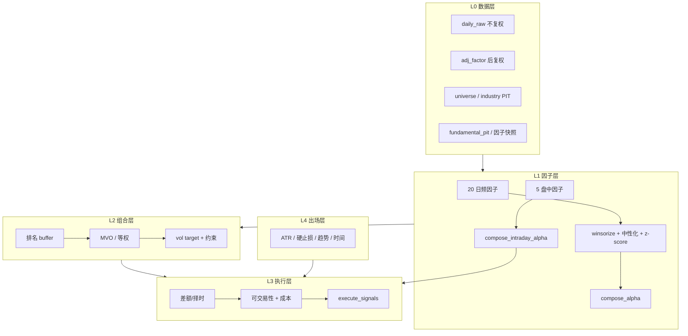
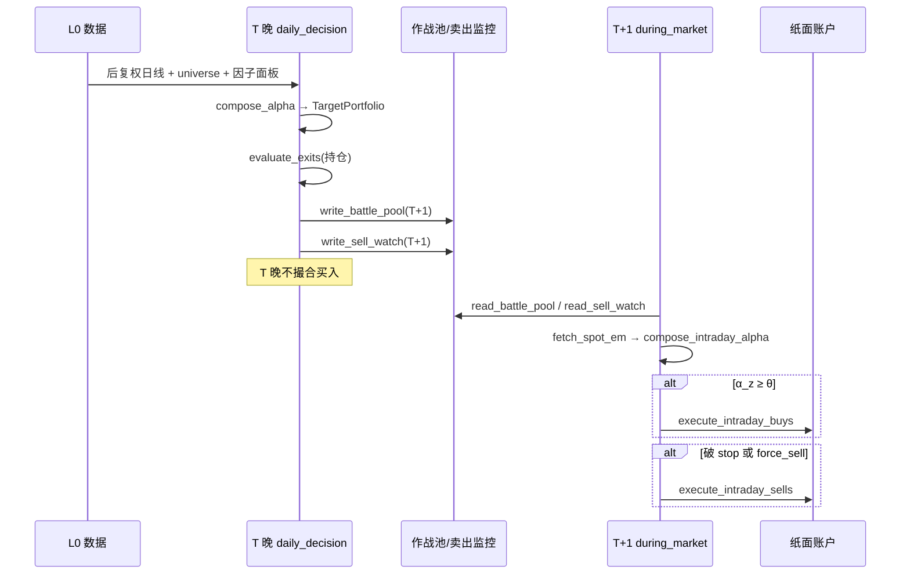

# 系统架构与交易闭环

## 1. 系统定位

| 项 | 说明 |
|---|---|
| 市场 | A 股（沪主 60 / 深主 00 / 创业板 30） |
| 风格 | 日频 **波段 / 主升跟随**，人在环路 + 纸面模拟 |
| 持仓周期 | 约 **5–20 个交易日** |
| 决策节奏 | **T 晚选股定计划**，**T+1 盘中择时买入**、盘中监控卖出 |
| 核心思想 | 横截面排名选股 + 时序规则出场；**选股与择时分离** |

**不适合**：分钟级打板、T0、年频长持。

### 设计原则

1. **可回溯优先**：主链路只用 ≤T 信息重建（PIT 数据、公告日闸门）
2. **相对优于绝对**：横截面排名，不用绝对分数阈值
3. **选股-择时分离**：日频因子选「买什么」，盘中因子选「何时买」
4. **横截面入场 + 时序出场**：排名处理相对变弱；ATR/破位处理个股崩塌

### 职责划分

| 组件 | 做什么 | 不做什么 |
|------|--------|----------|
| 因子 + 目标组合 + 撮合 | 决定买卖、仓位 | — |
| LLM | 解读新闻、写复盘叙述 | 不参与下单决策 |
| 候选池（THS/涨停/人气） | 飞书展示 enrich | 不参与 r3 alpha 选股 |

---

## 2. 项目结构

```text
GoldQuant/
├── common/                    # 公共基础设施（最底；config/timeutil/progress_log/utils）
├── app/                        # FastAPI 数据服务（默认 :8085）
│   ├── main.py                 # 启动 + APScheduler 调度 quant 任务
│   ├── api/v1/endpoints/       # 行情/热度/量化 payload 等 API
│   ├── services/               # enrich、概念/基本信息缓存
│   └── scheduling/             # quant_scheduler.py
├── quant/                      # 量化决策内核
│   ├── data/                   # L0 离线库、日历、复权、universe、PIT
│   ├── factors/                # L1 因子库、中性化、合成 alpha
│   ├── portfolio/              # L2 目标组合（MVO/buffer/约束）
│   ├── execution/              # L3 成本、滑点、撮合、风控闸门
│   ├── decision/               # 决策卡、纸面撮合入口
│   ├── backtest/               # 回测引擎
│   ├── exit/                     # L4 时序出场
│   ├── ops/                      # 运维推送正文
│   ├── jobs/                     # market job 执行
│   ├── services/market/          # payload 构建、盘中 session
│   ├── pool/                     # 候选池（展示用，非 alpha 选股）
│   ├── research/                 # walk-forward、IC、敏感性
│   ├── push/                     # 飞书推送
│   ├── store/                    # 路径、state、快照
│   └── config/quant.yml          # 默认策略配置
└── scripts/
    ├── decision/daily.py         # 日决策主脚本
    ├── data/                     # 离线库 build/update/maintain
    ├── backtest/                 # 回测入口
    └── factors/                  # IC 拟合、面板构建
```

---

## 3. 分层架构

**包依赖方向（硬约束）**：`common ← quant ← {app, scripts}`。

- `common/` 最底层，只依赖标准库/第三方（`config`/`timeutil`/`progress_log`/`utils`/`testing`）。
- `quant/` 中间层，只 import `common`，**禁止 import `app`**（r3 前经 HTTP、r3 起直调 service，均不经 app 包）。
- `app/` 与 `scripts/` 最上层，可 import `quant` 与 `common`。

运维五时段（news/pre/during/lunch/evening）payload 由 `quant/services/market/payload` 直调 service 构建（不经 HTTP）；`daily_decision` 用离线库。内置调度器（APScheduler）在 `app.main` 进程内，故自动跑五时段需 `python -m app`；单次 `python -m quant <mode>` 无需 app。

quant 内部 L0→L4：



| 层 | 主要代码 | 职责 |
|---|---|---|
| L0 | `quant/data/*` | Parquet 离线库、PIT universe/行业/基本面 |
| L1 | `quant/factors/*` | 因子计算、中性化、alpha 合成 |
| L2 | `quant/portfolio/target.py` | 目标权重、排名 buffer、MVO、约束 |
| L3 | `quant/execution/`, `quant/decision/paper_execute.py` | 纸面撮合、风控闸门 |
| L4 | `quant/exit/rules.py` | 时序出场规则 |
| 盘中择时 | `quant/services/market/intraday.py` | T+1 作战池内 intraday_alpha 触发 |

---

## 4. 交易闭环：选股 → 买入 → 卖出

### 4.1 时间线总览



### 4.2 T 晚：选股与定计划

**入口**：`python -m quant daily_decision` 或 `python -m scripts.decision.daily`

| 步骤 | 动作 | 代码 |
|---|---|---|
| 1 | 加载后复权日线、universe(T) | `load_adjusted_daily`, `universe_codes` |
| 2 | 构建近 5 日因子面板 | `build_panel` |
| 3 | 加载因子权重（walk-forward / 默认） | `load_factor_weights_info` |
| 4 | 合成截面 alpha、归因 | `compose_alpha`, `alpha_attribution` |
| 5 | 计算目标权重 | `TargetPortfolio.target_weights` |
| 6 | 生成决策卡 | `build_decision_card` |
| 7 | 对持仓跑 L4 出场评估 | `evaluate_exits` |
| 8 | 写作战池（alpha top N，默认 30） | `write_battle_pool(T+1)` |
| 9 | 写卖出监控（stop 价 + force_sell） | `write_sell_watch(T+1)` |
| 10 | 飞书推送 | `build_decision_push_body` |

**要点**：
- T 晚 **只定计划，不买入**；`target_weight` 供 T+1 盘中仓位上限参考
- 作战池规模默认 30（`--battle-pool-size` 可调）
- 无 `factor_weights_ts.yml` 时回退 registry 默认权重

### 4.3 T+1 盘中：买入

**入口**：`python -m quant during_market` → `quant/services/market/intraday.py`

| 步骤 | 规则 |
|---|---|
| 1 | 读当日 `battle_pool` |
| 2 | `fetch_spot_em()` 取全市场实时价 |
| 3 | 作战池内票构造 `SpotRow` → `compose_intraday_alpha` |
| 4 | **开盘 <10 分钟跳过**（噪声主导） |
| 5 | **α_z ≥ θ（默认 1.0）** 触发买入 |
| 6 | 仓位：基础 10% × (0.5 + 0.5×strength)，且 **≤ target_weight** |
| 7 | `execute_intraday_buys` → 整手、T+1、涨跌停、成本、ADV 参与率 |
| 8 | 幂等：`bought_today_{date}.txt` 防重复买 |

盘中因子详见 [FACTORS.md §2](./FACTORS.md#2-盘中因子择时层)。

### 4.4 T+1 盘中：卖出

**入口**：同一 `during_market` → `_intraday_sell_block`（**先卖后买**）

| 触发类型 | 来源 | 条件 |
|---|---|---|
| **force_sell** | T 晚 `evaluate_exits` | 趋势/时间/ATR 等已触发，次日应卖 |
| **stop 触发** | T 晚预计算的 `hard_stop` / `atr_stop` | 现价 ≤ 止损价 |

执行：`execute_intraday_sells` → 全平该票；幂等 `sold_today_{date}.txt`。

### 4.5 回测 vs 实盘纸面

| 维度 | 回测（strict 默认） | 实盘纸面 |
|---|---|---|
| 信号日 | T-1 收盘因子 | T 晚 alpha |
| 成交价 | T 开盘 | T+1 盘中最新价 |
| 买入逻辑 | 目标组合 **差额 rebalance** | 作战池 + **intraday_alpha** |
| 卖出 | 引擎内 `evaluate_exits` → 开盘卖 | T 晚 force_sell + 盘中 stop |
| 组合优化 | 同一 `TargetPortfolio` | target_weight 约束盘中仓位 |

回测 Sharpe **不完全代表**实盘路径；另有 `run_intraday_timing.py` 作择时探针。

---

## 5. L0 数据层

**根目录**：`$QUANT_HOME/data/`（默认 `~/.quant/data/`）

| 数据 | 路径 | 用途 |
|---|---|---|
| 不复权日线 | `store/daily_raw/year=YYYY/part.parquet` | 撮合、涨跌停用真实价 |
| 后复权因子 | `store/adj_factor/code=XXXXXX/part.parquet` | 与 daily_raw 合并得后复权序列 |
| Universe | `store/universe/year=YYYY/{date}.parquet` | ST/次新/停牌/ADV 过滤 |
| 行业 | `store/industry/year=YYYY/{date}.parquet` | 中性化、行业 cap |
| 基本面 PIT | `store/fundamental_pit/part.parquet` | ep/bp/roe/rev_yoy |
| 指数 | `store/index_daily/part.parquet` | 基准、熔断 |
| 交易日历 | `store/calendar.parquet` | 交易日判定 |
| 因子快照 | `store/fund_flow/`, `hot_rank/`, `theme_mom/` | flow、人气、主题 |

**为何分存不复权 + 复权因子**：增量来自 `spot_em`（不复权）；因子计算统一用后复权；撮合/涨跌停用真实价。

**Universe 规则**（`quant/data/universe.py`）：

1. 剔除 ST/*ST/退/PT
2. 上市 ≥ **120** 交易日（`DEFAULT_MIN_LIST_DAYS`）
3. 当日 `volume > 0`（非停牌）
4. 20 日 ADV ≥ 1 亿元（`candidate.universe.min_adv_yi` 可配）

---

## 6. L2 目标组合

**代码**：`quant/portfolio/target.py`（`TargetPortfolio`）

| 参数 | 默认 | 含义 |
|---|---|---|
| `n_enter` | 8 | 排名 ≤8 才允许新建仓 |
| `n_exit` | 15 | 已持仓排名 ≤15 才保留 |
| `max_stocks` | 10 | 最大持股数 |
| `full_invest` | 0.95 | 目标总仓位 |
| `target_vol` | 0.15 | 组合年化波动目标 |
| `max_weight` | 0.25 | 单票上限 |
| `sector_cap` / `concept_cap` | 0.40 | 行业/概念暴露上限 |
| `optimizer` | mvo | MVO 均值-方差优化 |
| `covariance.method` | ewma | EWMA 协方差 |
| `min_trade` / buffer | ~1% | 偏差过小不调仓 |

**排名 buffer**：`n_enter < rank ≤ n_exit` 的已持仓不因排名抖动频繁进出。

**注意**：实盘买入已改为「作战池 + 盘中择时」；目标组合框架保留供**回测 strict 口径**与 `target_weight` 参考。

---

## 7. L4 出场规则

**代码**：`quant/exit/rules.py` — `evaluate_exits`（**优先级从高到低**）

| 规则 | reason | 默认参数 | 触发条件 |
|---|---|---|---|
| 硬止损 | `hard_stop` | -8% 或 entry-2×ATR14 | 取较紧者 |
| ATR 跟踪 | `atr_trailing` | max(entry,最高收)-3×ATR14 | 收盘 ≤ 止损线 |
| 趋势止损 | `trend_stop_ma20` | 连续 2 日收 < MA20 | 破位 |
| 时间止损 | `time_stop` | 持有 >20 **交易日** 且浮亏 | 久盘无效 |
| 排名出场 | （经 L2） | rank > 15 | 目标权重 0 |

`ATR`：True Range 14 日均（`quant/exit/atr.py`）。持仓最高价由 `ExitTracker` / 元数据 `持仓最高价` 维护。

---

## 8. L3 执行与风控

**撮合**：`quant/execution/executor.py:execute_signals`

- 先卖后买；100 股整手；T+1 锁
- 涨跌停封板不可成交
- 成本：佣金、印花税、过户费、滑点（sqrt_law）
- 买单 ADV 参与率封顶（默认 10%）

**买入风控**（`quant/execution/risk_gate.py`，配置在 `gates.trading` + `portfolio.risk`）：

| 规则 | 默认 |
|---|---|
| 日内权益回撤 | -3% 禁开仓 |
| 大盘熔断 | 指数跌 -2% 禁开仓 |
| 组合回撤熔断 | -15% halt 5 日 |
| 止损冷却 | 止损后 3 日不再买同码 |
| 当日卖后禁买回 | 开启 |

---

## 9. 候选池（展示路径，非 alpha 选股）

`quant/pool/candidate_sources.py` 从三来源初筛（东财人气 / 涨停池 / 同花顺榜），经 `source_merge` 合并 enrich，主要用于 `post_market_evening` 等推送展示，**不参与** `scripts/decision/daily.py` 的因子选股。

配置见 `quant.yml` → `candidate` 段（`popularity_limit`、`zt_min_boards`、`include_ths_rank_pool` 等）。

---

## 10. 权重与研究闭环

```text
build_panel(历史) → ic_report / fit_weights
  → BH-FDR 显著性筛选
  → walk-forward 时变权重 → factor_weights_ts.yml
  → live daily_decision 按 as_of 取最近权重
  → backtest.run 同口径（--registry-weights 可忽略 IC）
```

| 文件 | 用途 |
|---|---|
| `~/.quant/config/factor_weights_ts.yml` | walk-forward OOS 权重（live 优先） |
| `~/.quant/config/factor_weights.yml` | 静态 IC 权重 |
| `REGISTRY.weights()` | 无上述文件时的默认权重 |

`research.factors.strict_oos_weights: true` 时，live 不用静态全样本权重。

---

## 11. 纸面账户与报告

纸面账户隔离在 `$QUANT_HOME/paper_account/`（`paper_home_context`），与人工主账户互不污染。

| 路径 | 含义 |
|---|---|
| `state/holding.jsonl` | 纸面持仓 |
| `state/account.json` | 现金/市值/总资产 |
| `state/equity.jsonl` | 每日权益曲线 |
| `battle_pool/{date}.json` | 作战池 |
| `sell_watch/{date}.json` | 卖出监控 |
| `state/bought_today_{date}.txt` | 当日已买（幂等） |

报告统一在 `$QUANT_HOME/reports/`（`decision/`、`bt/`、`ic/`、`wf/`、`ops/`）。
