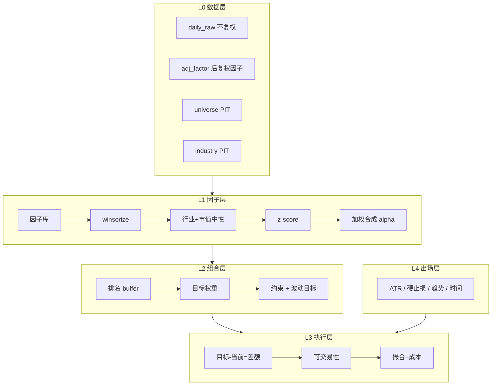
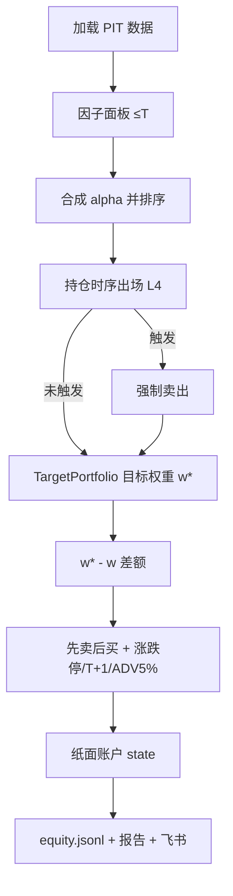

# GoldQuant r3 架构与指标说明

> 面向后期维护：说明 r3 **做什么、怎么算、数据落哪、和旧专家系统差在哪**。  
> 运维命令与飞书约定见 [R3_OPS.md](./R3_OPS.md)；历史重构计划见 [REBUILD_PLAN.md](./REBUILD_PLAN.md)。

---

## 1. 定位与适用周期

| 项 | 说明 |
|---|---|
| 风格 | A 股日频 **波段 / 主升跟随**，人在环路 + 纸面模拟 |
| 决策频率 | 日频（默认 T-1 信号 / T 开盘成交） |
| 核心持仓期 | **约 5–20 个交易日**（1–4 周） |
| 偏短 | 几天：硬止损 / 破 MA20 / ATR 回撤 / 排名掉出 `N_exit` |
| 偏长 | 偶发 3–6 周：趋势与排名持续在 buffer 内 |
| 不适合 | 分钟级打板、T0；也不是年频长持 |

设计原则（相对旧专家系统）：

1. **可回溯优先**：主链路数据必须能对历史日 T 只用 ≤T 信息重建。  
2. **相对优于绝对**：选股用横截面排名，不用绝对分数阈值。  
3. **目标组合优于逐笔信号**：每日算目标权重，交易差额。  
4. **横截面入场 + 时序出场**：排名处理「相对变弱」；崩塌用 ATR/破位等个股规则。

---

## 2. 分层架构



| 层 | 代码主路径 | 职责 |
|---|---|---|
| L0 | `quant/data/` | 离线 parquet 库、日历、复权、宇宙、行业 |
| L1 | `quant/factors/` | 因子计算、中性化、面板、合成 alpha |
| L2 | `quant/portfolio2/` | `TargetPortfolio`：buffer / 约束 / vol target |
| L3 | `quant/execution/` + `quant/decision/paper_execute.py` | 纸面撮合；回测用 `quant/backtest2/` |
| L4 | `quant/exit/` | 时序出场规则 |
| 运维 | `quant/ops/` | 新闻/盘前/盯盘/复盘 + 飞书 |
| 决策入口 | `scripts/decision/daily.py` / `python -m quant daily_decision` | 日决策闭环 |

---

## 3. 交易闭环（日频）



### 3.1 时间口径

| 模式 | 信号日 | 成交价 | 用途 |
|---|---|---|---|
| **默认 strict** | T-1 收盘因子 | T 开盘 | 实盘/纸面/默认回测 |
| loose | T 收盘因子 | T 收盘 | 乐观上界对照 |

### 3.2 差额交易

\[
\Delta V_i = (w^*_i - w_i) \times \text{总资产}
\]

换算整手股数后下单；\(|\Delta w|\) 小于缓冲则不动。

---

## 4. 数据层（L0）

根目录：`$QUANT_HOME`（默认 `~/.quant`）。

### 4.1 离线行情库 `store/`

| 路径 | 格式 | 内容 |
|---|---|---|
| `store/daily_raw/year=YYYY/part.parquet` | parquet | 不复权 OHLCV + 市值等 |
| `store/adj_factor/code=XXXXXX/part.parquet` | parquet | 后复权因子 |
| `store/universe/year=YYYY/{date}.parquet` | parquet | 当日是否纳入宇宙 |
| `store/industry/year=YYYY/{date}.parquet` | parquet | 行业 PIT |
| `store/index_daily/part.parquet` | parquet | 指数 |
| `store/calendar.parquet` | parquet | 交易日历 |

**为何分存不复权 + 因子**：增量来自 `spot_em`（不复权）；因子计算用后复权；撮合/涨跌停用真实价。

`daily_raw` 主字段：`code, date, name, open, high, low, close, pre_close, volume, amount, turnover_rate, float_mv, total_mv`。

写入：`scripts/data/build_daily.py`、`update_daily.py`。

### 4.2 Universe 规则（PIT）

| 规则 | 含义 | 计算要点 |
|---|---|---|
| 剔 ST/退 | 避免特殊风险 | 当日名称匹配 |
| 上市天数 | 过滤次新 | 首条日线起 ≥ 约 120 交易日 |
| 停牌 | 不可交易 | 如 `volume==0` |
| 流动性 | 避免死票 | 20 日 ADV ≥ 阈值 |

### 4.3 纸面账户 `paper_account/`

与人工主账户隔离（`override_quant_home`）。

| 文件 | 含义 |
|---|---|
| `state/holding.jsonl` | 纸面持仓 |
| `state/account.json` | 现金 / 市值 / 总资产 / 已实现盈亏 |
| `state/equity.jsonl` | 每日权益一行 |
| `daily/{date}/trades/executed.json` | 成交明细 |

持仓**不再写「战法」**。  
买入原因示例：`buy|rank=3|α=0.812|tw=12.0%|Δw=+12.0%|new_position`。

### 4.4 报告 `reports/`

全部在 `$QUANT_HOME/reports/`（不写仓库根目录）。见 [R3_OPS.md](./R3_OPS.md)。

---

## 5. 因子层（L1）指标含义与计算

因子在**后复权**序列上计算，且仅用 `≤ as_of` 的数据。

流水线：

```text
raw × direction → winsorize(1%,99%) → 行业+log市值中性 → z-score → Σ w_i z_i = alpha
```

| 因子 | 含义 | 计算 | 方向 | 默认权重 |
|---|---|---|---|---|
| `mom_20` | 短期收益（偏反转） | \(C_t/C_{t-20}-1\) | 负 | 0.8 |
| `mom_60` | 中期动量 | \(C_t/C_{t-60}-1\) | 正 | 1.0 |
| `mom_120_20` | 跳过近月的中期动量 | \(C_{t-20}/C_{t-120}-1\) | 正 | 1.0 |
| `mom_accel` | 动量加速 | \(mom_{20}-mom_{60}/3\) | 正 | 0.8 |
| `eff_ratio_60` | 趋势顺滑度 | \(\|净涨幅\|/\sum\|日收益\|\) | 正 | 1.0 |
| `vol_60` | 年化波动 | \(\mathrm{std}(r,60)\sqrt{252}\) | 负 | 0.8 |
| `downside_vol_60` | 下行波动 | 负收益半方差年化 | 负 | 0.6 |
| `dist_high_252` | 距 52 周高 | \(C/\max(H_{252})-1\) | 正 | 1.0 |
| `ma_spread` | 均线发散 | \(MA5/MA20-1\) | 正 | 0.8 |
| `ma_slope_20` | MA20 斜率 | 斜率 / 价格 | 正 | 0.6 |
| `vol_ratio_5_20` | 放量 | \(Amt_5/Amt_{20}\) | 正 | 0.8 |
| `turnover_z_60` | 换手偏高 | \((TO-\mu_{60})/\sigma_{60}\) | 正 | 0.6 |
| `vol_price_corr_20` | 量价配合 | \(\mathrm{corr}(vol,ret)_{20}\) | 正 | 0.6 |
| `flow_ratio_5` | 资金流入 | 5 日主力净流入/流通市值 | 正 | 0.6（常空） |
| `theme_mom` | 主题强度 | 同行业 `mom_20` 均值的截面分位（代理） | 正 | 0.6 |
| `hot_rank_z` | 人气 | 人气榜排名 z | 正 | 0.4（回测空） |

**方向**：`direction=-1` 表示原始值越大越看空，入库前乘以方向再中性化。  
**合成**：\(\alpha=\sum_i w_i\,z_i\)（\(w_i\) 为上表默认权重）。

代码：`quant/factors/library/*`、`neutralize.py`、`compose.py`、`panel_builder.py`。

---

## 6. 组合层（L2）参数与计算

实现：`quant/portfolio2/target.py`（`TargetPortfolio`）。

| 参数 | 默认 | 含义 | 用法 |
|---|---|---|---|
| `n_enter` | 8 | 新进门槛 | 排名 ≤ 8 才允许新建仓 |
| `n_exit` | 15 | 保留门槛 | 已持仓排名 ≤ 15 才保留，否则目标权重 0 |
| `max_stocks` | 10 | 最大持股数 | 截断 |
| `full_invest` | 0.95 | 目标总仓位 | 等权时单票 ≈ \(0.95/n\) |
| `target_vol` | 0.15 | 组合年化波动目标 | \(w \leftarrow w\cdot\mathrm{clip}(target/\sigma_{20},\,0,\,max)\) |
| `max_weight` | 0.25 | 单票上限 | 超限削减 |
| `sector_cap` | 0.40 | 单行业上限 | 行业权重和 |
| `concept_cap` | 0.40 | 单概念上限 | 多概念分别累加暴露 |
| `min_trade` / buffer | ~1% | 压换手 | 偏差过小不调仓 |
| `vol_lookback` | 20 | 已实现波动窗口 | 估计 \(\sigma_{20}\) |
| `equal_weight` | True | 默认等权 | False 时逆波动加权 |

**排名 buffer**：中间地带（`n_enter < rank ≤ n_exit`）的已持仓不因排名抖动频繁进出。

---

## 7. 出场层（L4）规则与计算

实现：`quant/exit/rules.py`。出场检查**优先于**再平衡。

| 规则 | reason | 含义 | 触发条件 |
|---|---|---|---|
| ATR 移动止损 | `atr_trailing` | 利润回撤 | \(C \le \max(入场价,持仓最高收盘)-3\times ATR_{14}\) |
| 硬止损 | `hard_stop` | 尾部风险 | \(C \le \max(入场\times 0.92,\ 入场-2\times ATR_{14})\)（取更紧=更高止损价） |
| 趋势止损 | `trend_stop_ma20` | 破位 | 连续 2 日收盘 < MA20 |
| 时间止损 | `time_stop` | 久盘无效 | 持有 > 20 **交易日** 且浮盈 < 0 |
| 排名出场 | （经 L2） | 相对变弱 | 排名 > `n_exit` → 目标权重 0 |

`ATR`：基于 True Range 的 14 日均（`quant/exit/atr.py`）。  
持仓最高价由 `ExitTracker` / 持仓元数据 `持仓最高价` 维护。

---

## 8. 执行层（L3）

### 8.1 纸面（日决策默认）

- 入口：`scripts/decision/daily.py` → `quant/decision/paper_execute.py` → `execute_signals`  
- 成本：佣金 / 印花税 / 滑点（`quant/execution/sim_rules.py`）  
- 约束：涨跌停封板、T+1、整手、单日成交额 ≤ ADV 5%  
- 账户：`$QUANT_HOME/paper_account/`

### 8.2 回测

- 入口：`scripts/backtest/run.py`  
- 引擎：`quant/backtest2/engine.py` + `SimBroker`  
- 默认同样 strict + `TargetPortfolio` + `ExitConfig`

| 执行相关量 | 含义 | 计算 |
|---|---|---|
| 目标买入金额 | 加仓规模 | \(\Delta w\times\) 总资产 |
| 股数 | 整手 | \(\lfloor amount/price/100\rfloor\times 100\) |
| ADV 上限 | 控冲击 | 成交金额 ≤ 当日 `amount×5%` |

---

## 9. 账户与绩效指标

| 指标 | 含义 | 计算要点 |
|---|---|---|
| 总资产 | 账户规模 | 现金 + 持仓市值 |
| 持仓市值 | 仓位 | \(\sum shares\times\) 现价 |
| 累计已实现盈亏 | 已平仓结果 | 卖出净额相对成本（扣费） |
| 权益曲线 | 策略轨迹 | `equity.jsonl` 按日追加 |
| 总收益 | 区间表现 | \(V_T/V_0-1\) |
| 年化收益 / 波动 | 风险收益 | 由日收益序列年化 |
| Sharpe | 风险调整 | 年化收益 / 年化波动 |
| Sortino | 下行风险调整 | 年化收益 / 下行波动 |
| 最大回撤 | 峰谷跌幅 | \(\min(V/\mathrm{peak}-1)\) |
| Calmar | 收益回撤比 | 年化收益 / \|最大回撤\| |
| 年化换手 | 交易强度 | 双边成交额 / 均权益 × 年化 |
| 胜率 / 盈亏比 | 交易质量 | 按卖出笔 pnl |
| 出场归因 | 哪类止损在亏 | 按 `Trade.reason` 分组 |

回测报告：`quant/backtest2/metrics.py`、`report.py` → `$QUANT_HOME/reports/bt/`。

---

## 10. 日运维与推送

实现：`quant/ops/`；调度：`app/scheduling/quant_scheduler.py`。

| 模式 | 飞书标签 | 内容要点 |
|---|---|---|
| `news` | 新闻聚焦 | LLM 去噪要点 + 综合解读 |
| `pre_market` | 盘前准备 | 新闻 / 指数 / 纸面账户 / 关注 |
| `during_market` | 智能盯盘 | 指数 / 纸面持仓 / 异动 |
| `post_market_lunch` | 午间复盘 | 午前指数 + 纸面账户 |
| `post_market_evening` | 收盘复盘 | 收盘指数 + 绩效/持仓 |
| `daily_decision` | 日决策·纸面成交 | 指令 / 成交 / 账户 / 持仓 |

推送格式：纯文本，`标题 + 时间 + 【小节】要点`（`quant/push/format.py`）。  
细节与 CLI 见 [R3_OPS.md](./R3_OPS.md)。

---

## 11. 关键入口速查

```bash
# 数据
python -m scripts.data.build_daily
python -m scripts.data.update_daily

# 日决策（默认纸面撮合 + 推送）
python -m quant daily_decision
python -m scripts.decision.daily --no-push   # 只落盘

# 运维推送
python -m quant news|pre_market|during_market|post_market_lunch|post_market_evening

# 研究
python -m scripts.backtest.run --start ... --end ...
python -m scripts.research.walk_forward --start ... --end ...
python -m scripts.factors.ic_report --panel ...
```

| 模块 | 路径 |
|---|---|
| 日决策 | `scripts/decision/daily.py` |
| 纸面撮合 | `quant/decision/paper_execute.py` |
| 目标组合 | `quant/portfolio2/target.py` |
| 出场 | `quant/exit/rules.py` |
| 回测引擎 | `quant/backtest2/engine.py` |
| 因子面板 | `quant/factors/panel_builder.py` |
| 运维推送 | `quant/ops/` |

---

## 12. 与顶级量化的差距（维护时勿高估）

本系统是 **可证伪的个人/小资金日频波段框架**，不是机构中性/高频：

- 数据厚度、退市补全、另类数据不足；  
- 因子数量与研究深度有限（`flow`/`theme`/`hot` 常为空或代理）；  
- 组合层无完整风险模型；  
- 执行假设偏简（开盘价、固定费率）；  
- 容量有限。

架构优势在于相对旧版：**PIT 宇宙、截面排名、目标组合、时序出场分离**，便于迭代，而不是信号本身已达机构水平。

---

## 13. 文档维护

| 文档 | 用途 |
|---|---|
| **本文件** | 架构、指标、闭环、模块地图 |
| [R3_OPS.md](./R3_OPS.md) | 落盘路径、CLI、飞书事件、退役清单 |
| [REBUILD_PLAN.md](./REBUILD_PLAN.md) | 重构阶段计划与 DoD（历史设计稿） |

参数或因子变更时：优先改代码旁注释，并同步更新 **§5 / §6 / §7** 表格。
