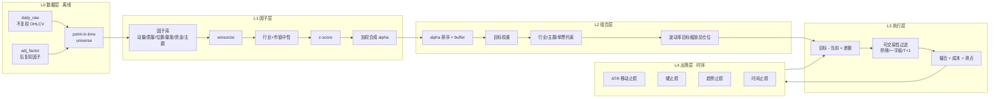

# GoldQuant 量化重构执行计划

> 版本：v1 · 2026-07-26
> 目标操作风格：A股波段 / 主升浪，日频决策，人在环路的辅助决策
> 环境基准：AKShare 1.18.63（已在 `.venv` 中验证接口可用性）

---

## 0. 为什么要重构，而不是继续改参数

当前系统有量化系统的**外形**（评分、权重、ML 校准、IC 监控），但内核是**专家系统**：

| 现状 | 后果 |
|---|---|
| 候选池 = 同花顺人气榜 | 无历史快照，任何回测都无法构造，策略不可证伪 |
| 打分 = 10 个手写维度的阶梯函数（约 100+ 个隐藏魔数） | 参数没有一个来自数据；ML 只能调 10 个外层权重，动不了内层 |
| 交易 = 逐笔信号触发 | 追高只能靠 `max_change_pct` 打补丁；补丁与信号强度无关，必然失效 |
| 绝对分数 + 固定阈值 | 牛市全过线、熊市全不过线，隐含顺周期 |
| `full_system` 回测因 `_inject_state` 丢字段而近乎零成交 | 验证闭环实际不存在 |

这三条不改，调任何参数都是在同一个架构里挪家具。

**但重构不等于推倒重来。** `quant/factors/` 这条线（`raw.py` + `neutralize.py` + `panel.py` + `compose.py`）已经是正确的骨架，只是被降级成 `neutral_alpha` 一个维度、权重 8–12 分，稀释在专家系统里。本计划的核心动作是**把这条线扶正为主干**，让 `scoring/dimensions/` 退居二线。

---

## 1. 设计原则

1. **可回溯优先于精巧。** 任何进入主链路的数据，必须能对任意历史交易日 T 重建，且只依赖 T 及之前的信息。做不到的降级为展示信息，不参与决策。
2. **相对优于绝对。** 选股用横截面排名，不用绝对分数阈值。
3. **目标组合优于逐笔信号。** 每日算目标持仓，交易差额。
4. **参数必须有预算。** 可调参数总数硬上限 25 个，超了就得砍功能。
5. **每个阶段独立可交付。** 任一阶段结束都能停下并保有价值，不产生半成品债务。

---

## 2. 目标架构



两个关键的架构判断：

- **横截面入场 + 时序出场。** 排名机制处理"相对变弱"，但趋势崩塌是个股事件，排名反应太慢，所以保留独立的时序止损（L4）。
- **波动率目标替代 regime 三档。** 用组合已实现波动率的倒数缩放总仓位，一个参数替代整套 `regime` + `hysteresis` + `position_pct` 配置。`regime` 降级为给人看的叙述信息。

---

## 3. 模块去留清单

### 3.1 保留不动

| 模块 | 理由 |
|---|---|
| `app/**` 全部 | 数据接入与 API 聚合层，与策略解耦，质量可以 |
| `quant/push/`、`quant/narrative/` | 输出层，重构后只是输入内容变了 |
| `quant/timeutil.py`、`trading_hours.py` | 时间工具 |
| `quant/execution/sim_rules.py`、`slippage.py` | A股撮合规则与滑点模型，直接复用 |
| `quant/backtest/broker.py` | 撮合器，被新回测框架复用 |
| `quant/research/significance.py` | DSR / 多重检验 |
| `quant/market/fund_flow.py`、`turnover.py` | 资金流与换手解析 |

### 3.2 改造扩展

| 模块 | 动作 |
|---|---|
| `quant/factors/**` | **扶正为主干**，从 6 个因子扩到 ~15 个，中性化扩到行业+市值 |
| `quant/store/state.py` | `_HOLDING_META_KEYS` 增加 `持仓最高价`、`买入ATR`、`买入排名` |
| `quant/portfolio/vol.py` | `atr_pct` 供出场层与波动率目标复用 |
| `quant/research/metrics/performance.py` | 补 Sharpe/Sortino/Calmar/基准超额 |

### 3.3 降级为因子（不丢弃，改用途）

| 模块 | 新用途 |
|---|---|
| `quant/pool/ths_rank_util.py`、`sources.py` | 人气榜从**准入门槛**降为**热度因子**（当日可用即可，不要求历史） |
| `quant/scoring/theme_boards.py`、`theme_tracker.py` | 主题热度 → 主题动量因子 |
| `quant/scoring/dimensions/zt_stats.py` | 涨停统计 → 因子（`stock_zt_pool_em(date)` 可回溯，能补历史） |

### 3.4 退役（保留文件，移出主链路，观察一季度后删除）

| 模块 | 理由 |
|---|---|
| `quant/scoring/dimensions/*.py`（10 个手写维度） | 阶梯函数魔数，被因子层取代 |
| `quant/scoring/engine.py::score_stock` 加权和 | 被 `compose_row_alpha` 取代 |
| `quant/signals/buy.py::_evaluate_buy_candidate` | 被目标组合差额取代 |
| `quant/ml/calibrate.py`、`optimizers.py` | 样本量支撑不了 Ridge/LGBM；改用 walk-forward 网格搜索 |
| `quant/scoring/regime.py` 的仓位控制职能 | 被波动率目标取代（regime 本身保留做叙述） |

> `quant/ml/validation.py` 的 walk-forward 工具保留并复用。

---

## 4. 阶段计划

### P0 · 数据地基（2–3 天，含拉数等待）

**这是唯一的硬依赖，在它完成之前任何策略改动都是浪费。**

#### 已验证的接口事实

- **不存在**"按日期返回全市场日线"的批量接口。扫描 AKShare 1.18.63 全部 51 个 date-keyed 无 symbol 接口，均为财务/龙虎榜/股东/融资融券/停复牌/涨停板，无一返回全市场 OHLCV。
- 建库只能逐只：`stock_zh_a_hist(symbol, period='daily', adjust='hfq')`
- 每日增量只需 1 次：`stock_zh_a_spot_em()` 返回沪深京全A（约 5400 行），含 `今开/最高/最低/最新价/昨收/成交量/成交额/换手率/量比/总市值/流通市值`。收盘后调用即为完整日线。
- 复权因子：`stock_zh_a_daily(symbol, adjust='hfq-factor')`（新浪源，docstring 明示大量抓取易封 IP，仅在除权时按需调用）
- 交易日历：`tool_trade_date_hist_sina()`
- 基准：`index_zh_a_hist(symbol='000300')` 等

#### 存储设计

```
data/store/
  daily_raw/year=YYYY/part.parquet      # 不复权，每日增量
  adj_factor/code=XXXXXX.parquet        # 后复权因子，按需更新
  index_daily/part.parquet
  universe/year=YYYY/part.parquet       # 逐日 point-in-time 快照
  calendar.parquet
```

`daily_raw` schema：`code, date, name, open, high, low, close, pre_close, volume, amount, turnover_rate, float_mv, total_mv`

**为什么存不复权 + 因子表，而不是直接存后复权？** `spot_em` 返回的是不复权价，直接追加到后复权序列会在除权日静默断裂——所有跨除权日的动量、均线、新高因子全部算错且不报错。分开存还有附带好处：撮合、涨跌停判定、最小价格变动单位都该用真实成交价，只有因子计算才需要复权价。

**除权检测：** 比对 `spot_em` 的 `昨收` 与库中前一交易日 `close`，不一致者即除权，仅对这几只（通常个位数到几十只）重取因子。

#### Universe 规则（全部 point-in-time）

| 规则 | 实现 | 可回溯性 |
|---|---|---|
| 剔除 ST/\*ST/退/PT | 名称字符串匹配（名称随每日快照落库） | ✅ 天然 PIT |
| 剔除上市不足 120 交易日 | 由 `daily_raw` 首条记录推断 | ✅ |
| 剔除当日停牌 | `volume == 0` 或 `stock_tfp_em(date)` | ✅ `tfp` 有 date 参数 |
| 20 日 ADV ≥ 5000 万 | 由 `amount` 滚动计算 | ✅ |

> **用名称匹配代替 `stock_zh_a_st_em()`**：后者只有当日快照、不可回溯；名称是随每日快照存下来的，天然 PIT。这条路实用得多。

**已知缺陷 — 幸存者偏差：** `spot_em` 只返回当前在市股票，历史退市股缺失，回测偏乐观。缓解手段是从 `stock_zh_a_stop_em()` 取退市名单逐只补历史。**本阶段不做**，先标注偏差：A股退市率不高且退市前基本长期挂 ST（本就被 universe 过滤），对波段策略影响远小于对长持策略。列入风险登记。

#### 交付物

| 文件 | 职责 |
|---|---|
| `quant/data/schema.py` | 表结构与字段常量 |
| `quant/data/store.py` | parquet 读写，按年分区，列裁剪 |
| `quant/data/calendar.py` | 交易日历，本地缓存，`trading_days_between(a,b)` |
| `quant/data/adjust.py` | 复权因子应用，不复权 ↔ 后复权互转 |
| `quant/data/universe.py` | `universe(date) -> list[code]`，PIT 保证 |
| `scripts/data/build_daily.py` | 全量初始化，断点续传，3–5 并发，失败重试 |
| `scripts/data/update_daily.py` | 每日增量：1 次 spot_em + 除权检测 + 因子补拉 |
| `scripts/data/verify_daily.py` | 抽样对比东财/新浪双源，检测断裂与缺失 |

#### 成本估算

- 建库：5400 次调用，串行约 1.5 小时，3–5 并发约 30 分钟（**不要开高并发，会被限流**）
- 存储：5 年约 675 万行，parquet 压缩后 200–400 MB
- 日常：每日 2 次请求（spot_em + 指数），秒级

#### 验收标准（DoD）

- [ ] 能对任意历史交易日 T 返回 `universe(T)`，人工抽查 3 个日期正确
- [ ] `universe(T)` 的实现中不存在任何对 T 之后数据的引用（代码走查 + 单测断言）
- [ ] 随机抽 20 只跨除权日的股票，复权后价格序列连续无跳变
- [ ] `update_daily.py` 连续正常运行 3 个交易日
- [ ] 漏抓某日时，`verify_daily.py` 能检出并给出补拉指令

> **运维硬约束：** `spot_em` 无历史，当天没抓就补不回来（只能退回逐只 `stock_zh_a_hist` 补区间）。增量任务必须有失败告警，另建议每月全量重拉校验一次。

---

### P1 · 因子层（4–5 天）

#### 因子清单

窗口选择的依据：**A股 1 个月内是反转、3–12 月是动量**，所以中期动量必须跳过最近 20 日。

| 族 | 因子 | 公式 | 方向 |
|---|---|---|---|
| 动量 | `mom_20` | `close/close[-20]-1` | 负（短期反转） |
| | `mom_60` | `close/close[-60]-1` | 正 |
| | `mom_120_20` | `close[-20]/close[-120]-1` | 正 |
| | `mom_accel` | `mom_20 - mom_60/3` | 正（主升启动） |
| 质量 | `eff_ratio_60` | `\|净涨幅\| / Σ\|日收益\|`（Kaufman） | 正（趋势顺滑度） |
| | `vol_60` | `std(ret,60)*√252` | 负 |
| | `downside_vol_60` | 下行半方差 | 负 |
| 位置 | `dist_high_252` | `close/max(high,252)-1` | 正（52周新高效应） |
| | `ma_spread` | `ma5/ma20-1` | 正（已有） |
| | `ma_slope_20` | `ma20` 的 20 日斜率 / 价格 | 正 |
| 量能 | `vol_ratio_5_20` | `amount(5均)/amount(20均)` | 正 |
| | `turnover_z_60` | 换手率相对自身 60 日均值的 z | 正 |
| | `vol_price_corr_20` | 成交量与收益的 20 日相关 | 正（量价配合） |
| 资金 | `flow_ratio_5` | 5 日主力净流入 / 流通市值 | 正（已有单日版） |
| 主题 | `theme_mom` | 所属概念板块 20 日动量的横截面分位 | 正 |
| 热度 | `hot_rank_z` | 人气榜排名 z（**仅实盘可用，回测置空**） | 正 |

> `eff_ratio_60` 是现有 `factor_path_ratio` 的规范化版本；`dist_high_252` 是"主升浪"最直接的因子化表达，取代 `main_wave` 那套形态规则。

#### 处理流水线

```
raw → winsorize(1%, 99%) → 行业中性(哑变量回归取残差) → 市值中性(log 流通市值) → z-score → 加权合成
```

行业分类用东财一级行业（`app/utils/industry_board_fetch.py` 已有），映射表落库并记录生效日期。

**合成权重先用等权。** 小样本下等权通常比 IC 加权更稳健，且省掉一个半衰期参数。IC 加权作为 P5 的对照实验，不作为默认。

#### 交付物

| 文件 | 职责 |
|---|---|
| `quant/factors/registry.py` | 因子注册表，替代硬编码的 `FACTOR_SPECS` |
| `quant/factors/library/momentum.py` | 动量族 |
| `quant/factors/library/quality.py` | 质量族 |
| `quant/factors/library/position.py` | 位置族 |
| `quant/factors/library/volume.py` | 量能族 |
| `quant/factors/library/flow.py` | 资金族 |
| `quant/factors/library/theme.py` | 主题族 |
| `quant/factors/neutralize.py` | 扩展为行业 + 市值双中性（现有文件改造） |
| `quant/factors/panel_builder.py` | 全历史面板批量构建，落 parquet |
| `scripts/factors/build_panel.py` | 面板构建入口 |
| `scripts/factors/ic_report.py` | IC 报告生成 |

#### IC 报告内容

对每个因子，计算对 1/3/5/10/20 日前瞻收益的：RankIC 均值、ICIR、IC 衰减曲线、5 分组单调性与多空收益、因子自相关（换手代理）。另出因子间相关系数矩阵。

#### 验收标准（DoD）

- [ ] 全历史因子面板可在 10 分钟内重建
- [ ] IC 报告能对 5 年历史跑出完整结果
- [ ] 至少 6 个因子满足 `|ICIR| > 0.3` 且 5 分组收益单调
- [ ] 因子相关矩阵中 `|corr| > 0.8` 的因子对已合并或剔除其一
- [ ] 单测：给定构造数据，每个因子的计算结果符合手算预期
- [ ] 单测：面板构建对日期 T 只读取 `<= T` 的数据（用截断数据集断言）

---

### P2 · 回测框架（3–4 天）

新建 `quant/backtest2/`，**不动老的 `quant/backtest/`**，避免半途破坏现有能力。

#### 主循环

```python
for T in trading_dates:
    u      = universe(T)                      # PIT
    panel  = factor_panel(T, u)               # 只用 <= T
    alpha  = compose(panel)
    target = construct_target(alpha, state)   # L2 组合层
    exits  = check_exits(state, T)            # L4 时序出场
    orders = diff(target, state.holdings, exits)
    fills  = broker.execute(orders, at=T_plus_1_open)
    state.update(fills)
```

#### 必须建模的约束

- **决策与执行分离**：T 收盘后生成信号，T+1 开盘成交。这是结构性延迟，不能省。
- T+1 制度：当日买入不可卖出
- 一字涨停不可买、一字跌停不可卖（用 `open == high == 涨停价` 判定）
- 停牌不可交易
- 成交量约束：单票单日成交额不超过当日总成交额的 5%
- 成本：佣金双边万 2.5（单笔最低 5 元）+ 印花税卖出千 1 + 滑点（复用 `quant/execution/slippage.py`）
- 最小交易单位 100 股

#### 绩效指标

年化收益 / 年化波动 / Sharpe / Sortino / Calmar / 最大回撤及持续期 / 月度收益表 / 年化换手率 / 平均持仓天数 / 胜率 / 盈亏比 / 单笔收益分布 / 按出场类型分组的盈亏 / 相对基准超额（沪深300、中证500、中证1000、等权全A）/ 分年度与分市况表现。

#### 交付物

| 文件 | 职责 |
|---|---|
| `quant/backtest2/engine.py` | 主循环 |
| `quant/backtest2/state.py` | 组合状态（现金、持仓、成本基准、最高价） |
| `quant/backtest2/costs.py` | 成本模型 |
| `quant/backtest2/tradability.py` | 可交易性过滤 |
| `quant/backtest2/report.py` | 指标计算与 HTML/Markdown 报告 |
| `scripts/backtest/run.py` | 回测入口，支持配置文件与日期区间 |

#### 验收标准（DoD）

- [ ] 5 年历史回测跑通，单次耗时 < 5 分钟
- [ ] **随机基准检验**：把 alpha 换成随机数，结果应接近等权全A扣成本后的表现（若显著更好，说明有前视泄漏）
- [ ] **前视泄漏检验**：把因子整体前移 1 日（用 T+1 的因子选 T 的票），Sharpe 应显著上升（若不上升，说明因子没起作用）
- [ ] 成本敏感性：成本翻倍后指标变化符合换手率推算
- [ ] 逐笔成交明细可导出，人工抽查 10 笔撮合价格与规则一致

> 前两项是回测框架正确性的**必检项**。绝大多数回测 bug 都能被这两个检验抓出来。

---

### P3 · 组合层（2–3 天）

#### 目标组合构建

1. alpha 降序排名
2. **Buffer zone**：`rank <= N_enter` 才买入；已持仓的 `rank <= N_exit` 就保留（`N_exit > N_enter`）。中间的排名波动不触发交易，可压掉一半以上换手。
3. 目标权重：先做**等权**（`1/max_stocks`）。alpha 分位加权作为 P5 对照实验。
4. 约束调整：单票 ≤ 25%，单行业 ≤ 40%，单概念 ≤ 40%
5. **总仓位波动率目标**：`w_total = clip(target_vol / realized_vol_20, 0, max_pos)`
6. 换手过滤：`|target_w - current_w| < min_trade` 不交易

**这一层直接解决"追高"：** 一只票涨多了权重超标 → 自动减仓；排名掉出 `N_exit` → 权重归零。约束是相对的、连续的，不再需要 `max_change_pct` 这类硬阈值补丁。

#### 概念集中度修正

现有 `quant/portfolio/constraints.py::concept_of_stock` 只取**第一个**概念，会严重低估实际集中度。改为：取该股全部概念，对每个概念分别累加暴露，任一超限即约束。

#### 交付物

| 文件 | 职责 |
|---|---|
| `quant/portfolio2/target.py` | 目标组合构建主逻辑 |
| `quant/portfolio2/buffer.py` | Buffer zone 换手抑制 |
| `quant/portfolio2/voltarget.py` | 波动率目标缩放 |
| `quant/portfolio2/constraints.py` | 行业/概念/单票约束（修正多概念问题） |

#### 验收标准（DoD）

- [ ] 相对 P2 的无约束 baseline，换手率下降 ≥ 40% 且 Sharpe 不劣化
- [ ] 波动率目标开启后，最大回撤下降且 Calmar 上升
- [ ] 约束生效性单测：构造超限场景，验证被正确削减
- [ ] 任意日期的目标权重之和 ≤ `max_pos`，单票 ≤ 上限

---

### P4 · 出场层（2 天）

| 规则 | 逻辑 |
|---|---|
| ATR 移动止损 | 从持仓期最高价回撤 `atr_mult_trail × ATR(14)` |
| 硬止损 | `买入价 - atr_mult_stop × ATR(14)` 与 `-8%` 取较紧者 |
| 趋势止损 | 收盘价连续 2 日低于 MA20 |
| 时间止损 | 持有 > `time_stop_days` 个**交易日**且浮盈 < 0 |
| 排名出场 | `rank > N_exit`（由 L2 自动处理，不单列） |

#### 必须删除的配置

`quant/config/quant.yml` 中：

- `stop_loss_eval_after_late_session`（尾盘才评估止损）
- `stop_loss_exempt_min_day_chg_pct`（当日涨超 3% 豁免止损）

这两条把情绪写进了代码——恰恰是这个系统要帮你避免的东西。

#### 状态字段扩展

`quant/store/state.py` 的 `_HOLDING_META_KEYS` 增加：`持仓最高价`、`买入ATR`、`买入排名`、`买入交易日序号`。

时间止损必须用**交易日**计数，接 `quant/data/calendar.py`，修正 `quant/strategy/time_stop.py` 现有的自然日口径。

#### 交付物

| 文件 | 职责 |
|---|---|
| `quant/exit/rules.py` | 四类出场规则 |
| `quant/exit/state.py` | 持仓期极值追踪 |

#### 验收标准（DoD）

- [ ] 回测中按出场类型分组的盈亏可归因，无某一类型长期净亏损
- [ ] 移动止损的持仓最高价追踪在回测与实盘链路口径一致
- [ ] 尾部风险改善：最大单笔亏损与亏损分布 95 分位均下降
- [ ] 单测：构造价格路径，验证每条规则的触发点

---

### P5 · 参数治理与验证（3–4 天）

#### 参数预算表（硬上限 25）

| 层 | 参数 | 数量 |
|---|---|---|
| Universe | `adv_min`, `min_list_days` | 2 |
| Factor | 因子集合（离散选择，非连续调参） | 0 |
| Portfolio | `N_enter`, `N_exit`, `max_stocks`, `target_vol`, `max_pos`, `min_trade`, `max_single`, `max_industry`, `max_concept` | 9 |
| Exit | `atr_mult_trail`, `atr_mult_stop`, `hard_stop_pct`, `ma_exit_days`, `time_stop_days` | 5 |
| **合计** | | **16** |

成本参数按真实费率固定，**不参与优化**。

#### Walk-forward 方案

训练窗 24 个月 / 测试窗 6 个月 / 滚动步长 6 个月。参数只在训练窗内网格搜索，测试窗只跑一次不回头调。

#### 稳健性检验

1. **Deflated Sharpe Ratio**：复用 `quant/research/significance.py`，按实际尝试的参数组合数做多重检验校正
2. **参数敏感性**：每个参数 ±30% 的绩效变化热力图。若某参数微小扰动导致绩效崩塌，说明是过拟合产物，砍掉或换成规则
3. **样本外一致性**：要求 `OOS Sharpe / IS Sharpe > 0.5`
4. **子区间稳定性**：分年度、分牛熊市况，不应只在单一区间盈利

#### ML 处置

淘汰 `quant/ml/calibrate.py` + `optimizers.py` 的 Ridge/LightGBM 权重校准——A股日频、5 年样本、十几个因子，样本量不足以支撑，且它调的是被因子层取代的那 10 个维度权重。保留 `quant/ml/validation.py` 的 walk-forward 工具供本阶段复用。

#### 验收标准（DoD）

- [ ] 可调参数总数 ≤ 25
- [ ] OOS Sharpe / IS Sharpe > 0.5
- [ ] DSR > 0（经多重检验校正后仍显著）
- [ ] 无单一参数在 ±30% 扰动下导致 Sharpe 下降超过 40%
- [ ] 分年度表现表中，亏损年份 ≤ 1 且亏损幅度可接受

---

### P6 · 辅助决策闭环（2 天）

**这一阶段才是直接打击情绪化交易的部分，不要跳过。**

#### 每日输出

| 内容 | 说明 |
|---|---|
| 目标持仓表 | 代码、名称、目标权重、alpha 排名、所属行业/概念 |
| 实际持仓表 | 当前真实持仓 |
| **差额指令表** | 买入/卖出/调仓，每条带触发原因与排名变化 |
| 出场预警 | 逼近移动止损/趋势止损的持仓 |
| 总仓位建议 | 波动率目标给出的仓位上限与当前仓位对比 |

#### 偏离记录

`quant/journal/deviation.py`：每日记录系统建议与你实际操作的差异，字段包括指令内容、是否执行、未执行原因（可选枚举：不认可信号 / 资金不足 / 手滑 / 主观看多看空 / 其他）、以及事后 5/10/20 日的收益对比。

月度复盘输出：**如果完全照系统执行 vs 实际执行，收益差多少**，并按偏离原因分组归因。

这是整个系统里唯一能量化"你的情绪值多少钱"的部件。前面五个阶段都是为了让系统的建议值得被跟随，这一阶段是让你知道没跟随的代价。

#### 决策漏斗统计

记录每日各环节的通过率：`universe 规模 → 有效因子覆盖 → 进入 top N_enter → 通过约束 → 通过可交易性 → 实际下单`。任一环节通过率异常（如长期为 0）立即暴露，避免重蹈 `full_system` 回测静默零成交的覆辙。

#### 验收标准（DoD）

- [ ] 每日目标持仓与差额指令能自动推送
- [ ] 偏离记录可录入并生成月度归因报告
- [ ] 决策漏斗各环节通过率可查，异常有告警

---

## 5. 时间线

| 阶段 | 工期 | 依赖 | 独立价值 |
|---|---|---|---|
| P0 数据地基 | 2–3 天 | — | 有了可回溯数据库，现有策略也能回测 |
| P1 因子层 | 4–5 天 | P0 | IC 报告本身就是选股参考 |
| P2 回测框架 | 3–4 天 | P0, P1 | 验证闭环建立 |
| P3 组合层 | 2–3 天 | P2 | 换手与追高问题解决 |
| P4 出场层 | 2 天 | P2 | 尾部风险改善 |
| P5 参数治理 | 3–4 天 | P3, P4 | 过拟合风险受控 |
| P6 决策闭环 | 2 天 | P3, P4 | 情绪化交易可量化 |

**总计约 3–4 周。** P3 与 P4 可并行。任一阶段边界都可以停下。

---

## 6. 风险登记

| 风险 | 影响 | 缓解 |
|---|---|---|
| 幸存者偏差（退市股缺失） | 回测偏乐观 | 已标注；A股退市率低且退市前多为 ST（已过滤）；后续可从 `stock_zh_a_stop_em()` 补 |
| 东财复权因子偶发错误 | 因子静默算错 | `verify_daily.py` 双源抽样对比 + 跨除权日连续性检查 |
| AKShare 接口变更/限流 | 数据中断 | 增量任务失败告警；`app/` 层已有东财直连回退 |
| A股因子半衰期短 | 上线即衰减 | 月度 IC 监控（`quant/research/factor/ic.py`），衰减因子自动降权 |
| 过拟合 | 样本外失效 | 参数预算 + walk-forward + DSR + 敏感性分析 |
| 回测与实盘偏离 | 建议不可信 | 复用 `quant/monitoring/parity.py` 做逐日对账 |
| 工期超预期 | 半成品债务 | 每阶段独立可交付，新代码走 `backtest2`/`portfolio2` 并行路径，不破坏现有系统 |

---

## 7. 明确不做的事

以下都是"机构在用但对这个场景不划算"的，列出来是为了防止范围蔓延：

| 不做 | 理由 |
|---|---|
| Barra 风格多因子风险模型 | 5–8 只持仓，协方差估计误差远大于信号 |
| 均值方差 / 风险平价优化 | 同上，且对输入极度敏感，等权更稳 |
| 深度学习 / 复杂 ML | 样本量支撑不了，可解释性差 |
| 日内微观结构、订单流 | 日频决策用不上 |
| 多策略配置与母子组合 | 只有一个策略 |
| 完整情景分析与压力测试框架 | 过重，用分市况分年度表现替代 |
| 实时风险监控系统 | 日频 + 人在环路足够 |
| 分钟级回测 | 波段策略无必要，且数据量增加两个数量级 |

---

## 8. 立即可以开始的第一步

P0 的三个脚本。建议顺序：

1. `quant/data/schema.py` + `quant/data/store.py` + `quant/data/calendar.py`（无网络依赖，可先写完测好）
2. `scripts/data/build_daily.py`，先用 50 只股票小规模验证流程，再全量跑
3. `scripts/data/update_daily.py` + 除权检测
4. `quant/data/universe.py` + PIT 单测
5. `scripts/data/verify_daily.py`

全量拉数建议放在夜间执行，3–5 并发，带断点续传。
