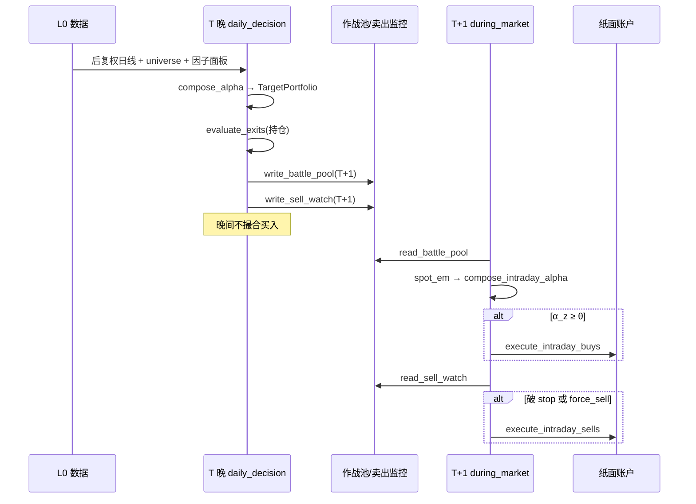

# GoldQuant 系统框架与流程闭环

> 本文档从代码出发，梳理 **系统分层、选股→买入→卖出闭环、各环节策略与因子**。  
> 运维命令见 [R3_OPS.md](./R3_OPS.md)；参数与公式细节见 [R3_ARCHITECTURE.md](./R3_ARCHITECTURE.md)；配置键映射见 [CONFIG_MAP.md](./CONFIG_MAP.md)。

---

## 1. 系统定位

| 项 | 说明 |
|---|---|
| 市场 | A 股（沪主 60 / 深主 00 / 创业板 30） |
| 风格 | 日频 **波段 / 主升跟随**，人在环路 + 纸面模拟 |
| 持仓周期 | 约 **5–20 个交易日**（硬止损、破 MA20、排名掉出 buffer、时间止损） |
| 决策节奏 | **T 晚选股定计划**，**T+1 盘中择时买入**、盘中监控卖出 |
| 核心思想 | 横截面排名选股 + 时序规则出场；选股与择时分离 |

**不适合**：分钟级打板、T0、年频长持。

---

## 2. 分层架构

```text
┌─────────────────────────────────────────────────────────────────┐
│ L0 数据层    daily_raw / adj / universe / industry / PIT 快照    │
├─────────────────────────────────────────────────────────────────┤
│ L1 因子层    原始因子 → winsorize → 行业+市值中性 → z-score      │
│              → compose_alpha（日频） / compose_intraday_alpha（盘中）│
├─────────────────────────────────────────────────────────────────┤
│ L2 组合层    排名 buffer → MVO/等权 → vol target → 行业/概念/风格 cap │
├─────────────────────────────────────────────────────────────────┤
│ L3 执行层    差额→整手→涨跌停/T+1/成本/滑点/ADV 参与率/风控闸门   │
├─────────────────────────────────────────────────────────────────┤
│ L4 出场层    ATR 跟踪 / 硬止损 / 趋势止损 / 时间止损 / 排名出场   │
└─────────────────────────────────────────────────────────────────┘
```

| 层级 | 主要代码 | 职责 |
|---|---|---|
| L0 | `quant/data/*`, `quant/store/paths.py` | PIT 可回溯数据、universe、基本面 pit |
| L1 | `quant/factors/library/*`, `panel_builder.py`, `compose.py` | 因子计算与 alpha 合成 |
| L2 | `quant/portfolio/target.py`, `mvo.py`, `constraints.py` | 目标权重与组合约束 |
| L3 | `quant/execution/executor.py`, `risk_gate.py`, `sim_rules.py` | 撮合、成本、买入风控 |
| L4 | `quant/exit/rules.py`, `state.py` | 个股时序出场 |

**盘中择时层**与日频 L1 平行：用 `SpotRow`（实时快照）合成 `intraday_alpha`，不参与日频 alpha 加权。

---

## 3. 流程闭环（选股 → 买入 → 卖出）

### 3.1 时间线总览



### 3.2 T 晚：选股与定计划

**入口**：`python -m scripts.decision.daily` 或 `python -m quant daily_decision`

| 步骤 | 动作 | 代码 |
|---|---|---|
| 1 | 加载后复权日线、universe(T) | `load_adjusted_daily`, `universe_codes` |
| 2 | 构建近 5 日因子面板 | `build_panel` |
| 3 | 加载因子权重（walk-forward / 默认） | `load_factor_weights_info` |
| 4 | 合成截面 alpha、归因 | `compose_alpha`, `alpha_attribution` |
| 5 | 计算目标权重（含 buffer、MVO、约束） | `TargetPortfolio.target_weights` |
| 6 | 生成决策卡（买/卖/调仓动作） | `build_decision_card` |
| 7 | 对持仓跑 L4 出场评估 | `evaluate_exits` |
| 8 | 写 **作战池**（alpha top N，默认 30） | `write_battle_pool(T+1)` |
| 9 | 写 **卖出监控**（stop 价 + force_sell） | `write_sell_watch(T+1)` |
| 10 | 设置 T+1 日内风控基准权益 | `set_day_start_equity` |
| 11 | 飞书推送（账户 + 作战池 + 卖出监控） | `build_decision_push_body` |

**要点**：
- T 晚 **只定计划，不买入**；`target_weight` 供 T+1 盘中仓位上限参考。
- 无 `factor_weights_ts.yml` 时回退 registry 默认权重，push 会标注「未校准」。

### 3.3 T+1 盘中：买入

**入口**：`python -m quant during_market`（定时或手动）→ `quant/ops/modes.py:_intraday_buy_block`

| 步骤 | 规则 |
|---|---|
| 1 | 读当日 `battle_pool` |
| 2 | `fetch_spot_em()` 取全市场实时价 |
| 3 | 作战池内票构造 `SpotRow` → `compose_intraday_alpha` |
| 4 | **开盘 <10 分钟跳过**（open 噪声大） |
| 5 | **α_z ≥ θ（默认 1.0）** 触发买入 |
| 6 | 仓位：基础 10% × (0.5 + 0.5×strength)，且 **≤ target_weight** |
| 7 | `execute_intraday_buys` → 整手、T+1、涨跌停、成本、ADV 参与率 |
| 8 | 幂等：`bought_today_{date}.txt` 防重复买 |

**盘中因子**（5 个，见 §5.2）：盘中走强、量比、涨速、涨跌幅、换手率。

### 3.4 T+1 盘中：卖出

**入口**：同一 `during_market` → `_intraday_sell_block`

| 触发类型 | 来源 | 条件 |
|---|---|---|
| **force_sell** | T 晚 `evaluate_exits` | 趋势/时间/ATR 等已触发，次日应卖 |
| **stop 触发** | T 晚预计算的 `hard_stop` / `atr_stop` | 现价 ≤ 止损价 |
| **排名出场** | 经 L2 | 排名 > `n_exit(15)` → 目标权重 0，逐步减仓 |

执行：`execute_intraday_sells` → 全平该票；幂等 `sold_today_{date}.txt`。

### 3.5 回测路径（对照）

**入口**：`python -m scripts.backtest.run --start ... --end ...`

| 维度 | 回测 | 实盘纸面 |
|---|---|---|
| 信号日 | strict：**T-1** 信号 | **T** 晚 alpha |
| 成交价 | strict：**T 开盘** | T+1 **盘中最新价** |
| 买入逻辑 | 目标组合 **差额 rebalance** | 作战池 + **intraday_alpha** |
| 卖出 | 引擎内 `evaluate_exits` → 开盘卖 | T 晚 force_sell + 盘中 stop |
| 组合优化 | 同一 `TargetPortfolio` | target_weight 约束盘中仓位 |

回测 Sharpe **不完全代表**实盘路径；盘中另有 `run_intraday_timing.py` 作择时探针，不产出完整权益曲线。

---

## 4. 各环节策略与要点

### 4.1 L0 数据层

**根目录**：`$QUANT_HOME`（默认 `~/.quant`）

| 数据 | 路径/模块 | PIT 说明 |
|---|---|---|
| 不复权日线 | `store/daily_raw/` | 撮合、涨跌停用真实价 |
| 后复权 | `adj_factor` + `load_adjusted_daily` | **因子计算统一用后复权** |
| Universe | `store/universe/` | ST/次新/停牌/ADV 过滤 |
| 行业 | `store/industry/` | 仅读历史快照，不用「当前行业」回填 |
| 基本面 | `store/fundamental_pit/` | `announce_date` 闸门 + TTM EPS |
| 指数 | `store/index_daily/` | 基准超额、风格归因 |
| 因子快照 | fund_flow / hot_rank / theme_mom | flow、人气、主题；回测常空 |

**Universe 规则**（`quant/data/universe.py`）：

1. 剔除 ST/*ST/退/PT  
2. 上市 ≥ **120** 交易日（`DEFAULT_MIN_LIST_DAYS`）  
3. 当日 `volume > 0`（非停牌）  
4. 20 日 ADV ≥ 1 亿元（可配）

**日更管线**：`scripts/data/update_daily.py` — spot_em → daily_raw、名称快照、披露季刷新 fundamental_pit、hot/flow/theme 快照。

### 4.2 L1 选股：因子流水线

```text
BarSeries(后复权 OHLCV + float_mv)
  → 各因子 raw 值 × direction
  → 截面 winsorize(1%, 99%)
  → 行业哑变量 + log(流通市值) 回归残差
  → 截面 z-score
  → Σ w_i · z_i = alpha
```

- **中性化**：`quant/factors/neutralize.py`  
- **合成**：`quant/factors/compose.py:compose_alpha`  
- **权重**：优先 `config/factor_weights_ts.yml`（walk-forward），否则 registry 默认  
- **IC 拟合**：`scripts/factors/fit_weights.py` + BH-FDR（`research.fdr_alpha: 0.05`）

### 4.3 L2 组合层：TargetPortfolio

**代码**：`quant/portfolio/target.py`

**实盘配置**（`quant/config/quant.yml` → `portfolio` 段）：

| 参数 | 典型值 | 含义 |
|---|---|---|
| `optimizer` | **mvo** | SLSQP 均值-方差优化 |
| `covariance.method` | **ewma** | EWMA 协方差 |
| `risk_budget.vol_lookback` | **14** | 波动/协方差窗口 |
| `n_enter` / `n_exit` | 8 / 15 | 新进 / 保留排名 buffer |
| `max_stocks` | 10 | 最大持股数 |
| `target_vol` | 0.15 | 组合年化波动目标 |
| `full_invest` | 0.95 | 目标总仓位 |
| `max_weight` | 0.25 | 单票上限 |
| `sector_cap` / `concept_cap` | 0.40 | 行业/概念暴露上限 |

**流程**：

1. `apply_rank_buffer` — 排名 8–15 为 buffer，减少抖动  
2. 截断至 `max_stocks`  
3. MVO（μ=alpha，λ=2.0）或等权/逆波动  
4. `scale_to_target_vol`  
5. 单票/行业/概念/小市值/高动量约束  
6. `apply_buffer` — \|Δw\| < 1% 不调仓  

**注意**：yml 中 `style_exposure.alpha_weighted: true` 在 **MVO 分支优先时不生效**。

### 4.4 L3 执行与风控

**撮合**：`quant/execution/executor.py:execute_signals`

- 先卖后买；100 股整手；T+1 锁  
- 涨跌停封板不可成交  
- 成本：佣金、印花税、过户费、滑点（sqrt_law，见 `gates.trading.simulation`）  
- 买单 ADV 参与率封顶（默认 10%）

**买入风控**（`quant/execution/risk_gate.py`，仅约束买入）：

| 规则 | 默认 |
|---|---|
| 日内权益回撤 | -3% 禁开仓 |
| 大盘熔断 | 指数跌 -2% 禁开仓 |
| 组合回撤熔断 | -15% halt 5 日 |
| 止损冷却 | 止损后 3 日不再买同码 |
| 当日卖后禁买回 | 开启 |

### 4.5 L4 出场规则

**代码**：`quant/exit/rules.py` — `evaluate_exits`（**优先级从高到低**）

| 规则 | reason | 默认参数 | 含义 |
|---|---|---|---|
| 硬止损 | `hard_stop` | -8% 或 entry-2×ATR14（取较紧） | 尾部风险 |
| ATR 跟踪 | `atr_trailing` | max(entry,最高收)-3×ATR14 | 利润回撤 |
| 趋势止损 | `trend_stop_ma20` | 连续 2 日收 < MA20 | 破位 |
| 时间止损 | `time_stop` | 持有 >20 **交易日** 且浮亏 | 久盘无效 |
| 排名出场 | （经 L2） | rank > 15 | 相对变弱 → 目标权重 0 |

持仓最高价由 `ExitTracker` / 持仓元数据 `持仓最高价` 维护。

---

## 5. 因子全表

### 5.1 日频因子（20 个，进入 REGISTRY / alpha）

合成公式：\(\alpha = \frac{\sum_i w_i z_i}{\sum_i w_i}\)，\(z_i\) 为中性化后截面 z-score；\(w_i\) 为 IC 权重或默认权重。

**direction**：+1 表示原始值越大越看多；-1 表示取反后再中性化。

#### 动量族（`library/momentum.py`）

| 因子 | 含义 | 计算 | 方向 | 默认权重 | 作用 |
|---|---|---|---|---|---|
| `mom_20` | 短期收益 | \(C_t/C_{t-20}-1\) | **-1** | 0.8 | A 股 1 月内偏反转，捕捉短期超买回落 |
| `mom_60` | 中期动量 | \(C_t/C_{t-60}-1\) | +1 | 1.0 | 3 月左右趋势延续 |
| `mom_120_20` | 跳过近月的动量 | \(C_{t-20}/C_{t-120}-1\) | +1 | 1.0 | 剔除近 20 日噪声的中期动量 |

#### 质量族（价量，`library/quality.py`）

| 因子 | 含义 | 计算 | 方向 | 默认权重 | 作用 |
|---|---|---|---|---|---|
| `eff_ratio_60` | 趋势顺滑度 | \|净涨幅\| / Σ\|日收益\|（60 日） | +1 | 1.0 | 单边顺滑 > 锯齿震荡 |
| `flip_rate_60` | 方向反转频率 | 60 日涨跌符号翻转比例 | **-1** | 0.6 | 与 eff_ratio 正交，剔除上蹿下跳 |
| `vol_60` | 年化波动 | std(日收益,60)×√252 | **-1** | 0.8 | 低波动偏好 |

#### 基本面族（PIT，`library/fundamental.py`）

数据：`fundamental_pit` → `panel_builder` 注入 `bars.extras`。

| 因子 | 含义 | 计算 | 方向 | 默认权重 | 作用 |
|---|---|---|---|---|---|
| `ep_ttm` | 盈利收益率 | 1/PE_TTM（亏损带符号 ep） | +1 | 0.8 | 价值：便宜盈利 |
| `bp` | 账面市值比 | 1/PB（BPS/价格） | +1 | 0.6 | 价值：账面溢价 |
| `roe` | 净资产收益率 | 披露 ROE | +1 | 1.0 | 盈利能力 |
| `rev_yoy` | 营收同比 | 披露 rev_yoy | +1 | 0.8 | 成长 |

#### 位置/趋势族（`library/position.py`）

| 因子 | 含义 | 计算 | 方向 | 默认权重 | 作用 |
|---|---|---|---|---|---|
| `dist_high_252` | 距 52 周高 | \(C/\max(H_{252})-1\) | +1 | 1.0 | 接近新高 = 主升 |
| `ma_spread` | 均线发散 | MA5/MA20 - 1 | +1 | 0.8 | 短期均线在上 |
| `spread_accel_5` | 发散加速度 | ma_spread(t) - ma_spread(t-5) | +1 | 0.6 | 启动/见顶导数信号 |
| `ma_slope_20` | MA20 斜率 | (MA20_now - MA20_prev) / 价格 | +1 | 0.6 | 趋势方向与强度 |

#### 量能族（`library/volume.py`）

| 因子 | 含义 | 计算 | 方向 | 默认权重 | 作用 |
|---|---|---|---|---|---|
| `vol_ratio_5_20` | 放量 | 5 日均额 / 20 日均额 | +1 | 0.8 | 近期资金活跃度 |
| `turnover_z_60` | 换手异常 | (TO - μ_60) / σ_60 | +1 | 0.6 | 相对自身历史的换手偏高 |
| `vol_price_corr_20` | 量价配合 | corr(日收益, 成交量, 20) | +1 | 0.6 | 价涨量增协同 |

#### 资金/主题/人气族

| 因子 | 文件 | 含义 | 计算 | 方向 | 默认权重 | 备注 |
|---|---|---|---|---|---|---|
| `flow_ratio_5` | `flow.py` | 主力净流入 | extras 快照或 (近5额-前5额)/流通市值 | +1 | 0.6 | 回测常空，有量价代理 |
| `theme_mom` | `theme.py` | 主题强度 | 同行业 mom_20 截面分位（快照） | +1 | 0.6 | 依赖 theme 快照 |
| `hot_rank_z` | `hot.py` | 人气 | 人气榜排名 z（PIT 快照） | +1 | 0.4 | 回测常空 |

### 5.2 盘中因子（5 个，择时层，不进日频 alpha）

**代码**：`quant/factors/library/intraday.py`  
**合成**：`compose_intraday_alpha` — 作战池内截面 z-score，**不做**行业/市值中性。

| 因子 | 含义 | 计算（live） | 默认权重 | 作用 |
|---|---|---|---|---|
| `intraday_strength` | 盘中走强 | (最新价 - 今开) / 今开 | 1.0 | 开盘后上行力度 |
| `volume_ratio` | 量比 | spot_em 量比字段 | 1.0 | 相对近期放量 |
| `speed` | 涨速 | spot_em 涨速(%) | 0.8 | 盘中短期加速 |
| `day_change` | 当日涨跌 | 涨跌幅(%) | 0.6 | 当日强度 |
| `turnover` | 换手率 | 换手率(%) | 0.5 | 当日交易活跃 |

**日频代理回测**（`spot_row_from_daily`）：`speed` 用 \((close-open)/open×100\) 近似。

**触发**：α_z ≥ **θ = 1.0**（`ops/modes._intraday_buy_block`）。

---

## 6. 权重与研究闭环

```text
build_panel(历史) → ic_report / fit_weights
  → BH-FDR 显著性筛选
  → walk-forward 时变权重 → factor_weights_ts.yml
  → live daily_decision 按 as_of 取最近权重
  → backtest.run 同口径（--registry-weights 可忽略 IC）
```

| 文件 | 用途 |
|---|---|
| `config/factor_weights_ts.yml` | walk-forward OOS 权重（live 优先） |
| `config/factor_weights.yml` | 静态 IC 权重 |
| `REGISTRY.weights()` | 无上述文件时的手调默认 |

**严格 OOS**：`research.factors.strict_oos_weights: true` 时，live 不用静态全样本权重。

---

## 7. 配置、入口与落盘

### 7.1 常用入口

| 命令 | 作用 |
|---|---|
| `python -m scripts.decision.daily` | T 晚决策闭环 |
| `python -m quant during_market` | T+1 盘中买卖 + 推送 |
| `python -m scripts.data.update_daily` | 收盘后数据增量 |
| `python -m scripts.data.build_fundamental_pit` | 基本面 PIT 全量/增量 |
| `python -m scripts.factors.fit_weights --walk-forward` | IC 权重拟合 |
| `python -m scripts.backtest.run --start ... --end ...` | 日频回测 |

### 7.2 纸面账户（`$QUANT_HOME/paper_account/`）

| 文件 | 含义 |
|---|---|
| `state/holding.jsonl` | 持仓 |
| `state/account.json` | 现金/市值/总资产 |
| `state/equity.jsonl` | 每日权益 |
| `battle_pool/{date}.json` | 作战池 |
| `sell_watch/{date}.json` | 卖出监控 |

### 7.3 报告（`$QUANT_HOME/reports/`）

`decision/` — 决策卡；`bt/` — 回测 metrics + 敏感性。

---

## 8. 模块索引

| 模块 | 路径 |
|---|---|
| 日决策 | `scripts/decision/daily.py` |
| 纸面执行 | `quant/decision/paper_execute.py` |
| Ops 推送 | `quant/ops/modes.py`, `runner.py` |
| 因子面板 | `quant/factors/panel_builder.py` |
| 因子注册 | `quant/factors/registry.py` |
| 目标组合 | `quant/portfolio/target.py` |
| 回测引擎 | `quant/backtest/engine.py` |
| 出场 | `quant/exit/rules.py` |
| 配置 | `quant/config.py`, `quant/config/quant.yml` |

---

## 9. 相关文档

| 文档 | 内容 |
|---|---|
| [R3_ARCHITECTURE.md](./R3_ARCHITECTURE.md) | 分层架构、公式表、strict 口径 |
| [R3_OPS.md](./R3_OPS.md) | 运维 CLI、飞书、定时任务 |
| [CONFIG_MAP.md](./CONFIG_MAP.md) | quant.yml 键 → 代码映射 |
| [量化评估V8.md](./量化评估V8.md) | 审计结论、因子扩展建议、验证缺口 |
| [REBUILD_PLAN.md](./REBUILD_PLAN.md) | r1→r3 重构历史 |

---

*文档版本：与 r3 代码同步（2026-07）；因子数以 `quant/factors/library/__init__.py` 为准。*
